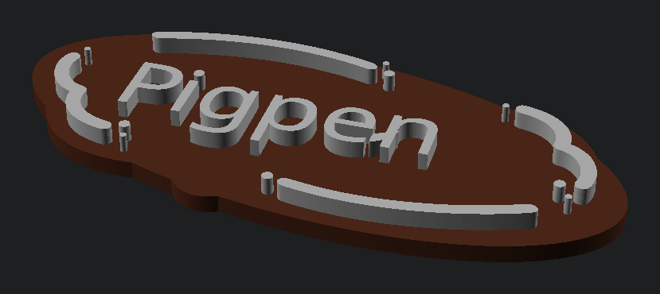
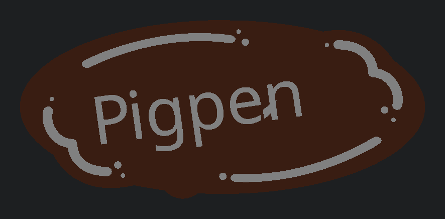
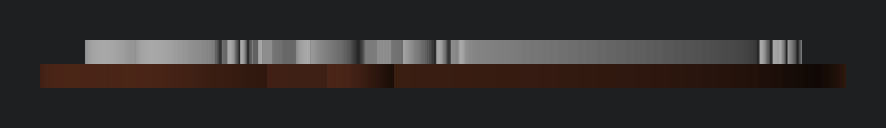

# openscad-pigpen

Turns the layered Pigpen logo in `pigpen_logo.xcf` into a printable two-layer
plaque: a dark base with the light details raised on top of it.



The finished models are committed under [`dist/`](dist/) — grab
[`dist/stl/pigpen.stl`](dist/stl/pigpen.stl) and print it without installing any
of the toolchain below. GitHub renders those STLs in its own 3-D viewer.

| | |
| --- | --- |
|  |  |

```
pigpen_logo.xcf
  │  make layers     GIMP exports each layer to a full-canvas PNG, alpha intact
  ▼
build/layers/*.png
  │  make trace      alpha → 1-bit mask → potrace → SVG
  ▼
build/svg/*.svg
  │  make config     measures the artwork so WIDTH_MM can mean millimetres
  ▼
build/config.scad ── included by ── pigpen.scad
  │  make stl / make preview
  ▼
dist/stl/*.stl, dist/img/*.png     ← committed
```

`pigpen.scad`, the `Makefile` and `tools/` are the sources. `build/` is
scratch space and is ignored; `dist/` is generated too, but it is committed, so
re-run `make all` and commit the result whenever the model changes.

Every `.scad` in the project root gets an STL and a set of previews
automatically — the Makefile globs for them, so adding a second model needs no
edit there.

## Quick start

```sh
make tools     # confirm gimp, openscad, potrace, magick, python3 are installed
make all       # trace, build all three STLs, render the previews
make check     # measure the STLs and assert they are the requested size
```

`make` on its own prints the target list and the current settings.

## Output

All of this is committed, so the table doubles as the download list.

| File | What it is |
| --- | --- |
| `dist/stl/pigpen.stl` | Both layers as one solid |
| `dist/stl/pigpen-dark.stl` | Just the base |
| `dist/stl/pigpen-light.stl` | Just the raised light layer, already sitting at z = `DARK_H` |
| `dist/img/pigpen-{iso,top,front}.png` | Rendered previews, trimmed to the model |
| `dist/img/layers.png` | Contact sheet of the raw layer split, from `make layer-sheet` |

The STLs are exported as binary (`STL_FORMAT=binstl`) — about a fifth the size
of OpenSCAD's ASCII default, which is worth caring about for a file that lives
in git history. `make clean` deletes `dist/`; `make all` puts it back.

The two part STLs are in a shared coordinate frame, so a slicer that imports both
lines them up without any manual positioning. That is the route for a two-colour
print: load them as separate objects/extruders, or slice the combined STL and put
a filament change at `DARK_H`.

## Settings

Override any of these on the command line — no need to edit files:

```sh
make stl WIDTH_MM=200 DARK_H=4 LIGHT_H=2
make preview BASE_MODE=knockout
```

| Variable | Default | Meaning |
| --- | --- | --- |
| `WIDTH_MM` | `120` | Printed width of the artwork; height follows the aspect ratio |
| `DARK_H` | `3.5` | Base thickness, mm |
| `LIGHT_H` | `3.5` | Raised layer thickness, mm |
| `BASE_MODE` | `silhouette` | See below |
| `DARK_LAYER` / `LIGHT_LAYER` | `DarkPart` / `LightPart` | Layer names in the `.xcf` |
| `TRACE_SCALE` | `1` | Upsample before tracing; raise if fine detail looks faceted |
| `VIEWS` | `iso top front` | Previews rendered per model; each needs a `CAM_`/`PROJ_` pair |
| `STL_FORMAT` | `binstl` | `asciistl` if you want a readable mesh |

At the defaults the model is **120 × 52.85 × 7 mm**.

## `BASE_MODE`, and why it exists

In the artwork the light details are *knocked out* of the dark layer — the two
are complementary, not stacked. The dark layer has holes exactly where the text
and swooshes go.

- **`silhouette`** (default) merges the two into a solid base, so the light layer
  always has something underneath it. This is the printable one.
- **`knockout`** uses the dark layer exactly as drawn, holes and all. The light
  layer then floats 3.5 mm above nothing. Useful for looking at the artwork, not
  for printing.

The merge happens on the *masks*, before tracing, not on the traced outlines in
OpenSCAD. That is deliberate: because the layers were knocked out of each other,
their two traces run along the same edge from opposite sides, and unioning those
outlines in OpenSCAD leaves contours that touch at single points. `linear_extrude`
turns that into a mesh CGAL rejects — and OpenSCAD then drops the base, exits 0,
and writes a perfectly valid STL containing only the light layer. `make check`
exists because of that failure mode, and the build now treats any OpenSCAD
`ERROR:` line as fatal regardless of exit status.

## Printing notes

- The smallest features are the little dots in the light layer: about **1.33 mm
  across and 3.5 mm tall** at `WIDTH_MM=120`. Printable with a 0.4 mm nozzle but
  delicate — scale up, or reduce `LIGHT_H`, if they snap off.
- The light layer is 20 separate pieces. Fine for a filament swap or a
  multi-material printer; painful if you were planning to print it separately and
  glue it on.

## How the sizing works

`import()` in OpenSCAD is the one step here that could silently render at the
wrong scale, so it is pinned down rather than trusted:

- `tools/trace_layer.sh` rewrites potrace's SVG header to plain, unitless user
  units matching the *source canvas*, so `TRACE_SCALE` cannot change the result.
- `pigpen.scad` imports with `dpi = 25.4`, which makes one source pixel exactly
  one millimetre.
- `tools/svg_bbox.py` measures the traced artwork — solving each cubic for its
  extrema, not just taking control points — and writes `build/config.scad`.
- `WIDTH_MM` is then a plain ratio against that measurement.
- `make check` measures the finished STLs and fails if they are more than
  0.05 mm off.

Every layer is exported at full canvas size, which is what keeps the layers
registered to each other: all of them share one coordinate frame, so nothing has
to be re-aligned downstream.

## Requirements

GIMP 3.x (`gimp-console`, uses the `python-fu-eval` batch interpreter),
OpenSCAD, potrace, ImageMagick 7 (`magick`), Python 3. `make tools` checks.

## If you re-edit the `.xcf`

Just run `make` again. If you rename or add layers, `make layers` prints what it
found, and a mismatch tells you which names are available.
